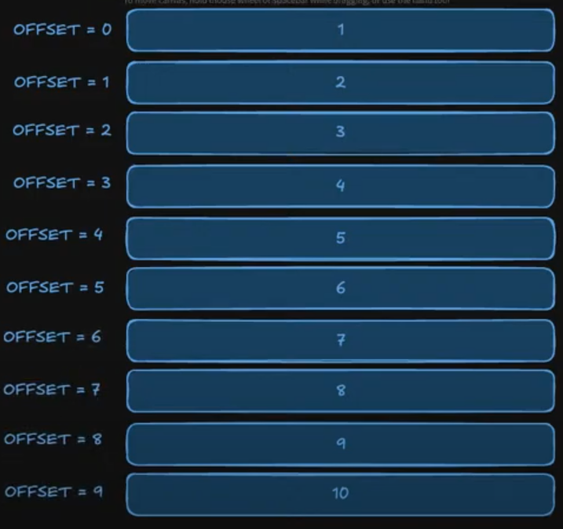
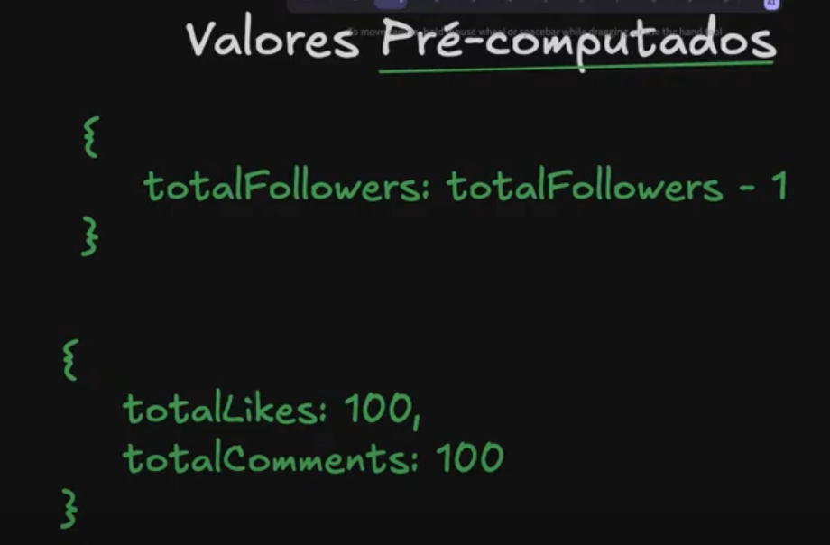

## OFFSET Based Pagination
 A partir de onde deve iniciar a leitura, a contagem inicia em zero como um array

 

  Seq scan

## CURSOR Based Pagination
Precisamos ter os dados ordenados

Index scan

## Valores pré computados

